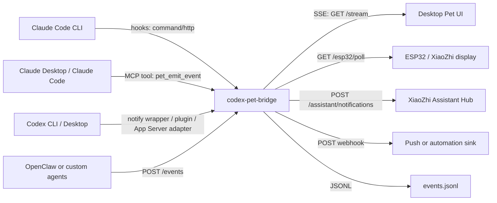

<div align="center">

# Codex Pet Bridge

**Local-first status bridge for Codex, Claude Code, desktop pets, and XiaoZhi devices.**

One small hub. Every agent state, visible.

English · [中文](README.zh-CN.md)

[](LICENSE)
[](https://nodejs.org/)
[](#project-status)
[](#security-model)

</div>

---

## The Problem

Long-running coding agents are useful only if you notice the right moment to step back in. Codex, Claude Code, Claude Desktop, OpenClaw, and custom automations may all be running on different machines, but their status usually stays trapped inside each app window.

That creates three practical problems:

1. **Attention is fragmented**: one task waits in Codex, another needs approval in Claude Code, and neither is visible from the room.
2. **Integrations are brittle**: patching app bundles or scraping UI state breaks whenever upstream tools update.
3. **Physical indicators need a stable contract**: a desktop pet, ESP32 screen, or XiaoZhi robot should consume the same clean event model instead of learning every upstream payload shape.

Codex Pet Bridge is a local notification hub for that missing layer.

## What It Does

- Normalizes upstream agent signals into a stable `PetEvent` model.
- Builds an unread `PetNotification` queue for events that need human attention.
- Streams live state to a desktop pet UI over Server-Sent Events.
- Exposes a compact polling API for ESP32 / XiaoZhi-style devices.
- Forwards semantic status events to the XiaoZhi Assistant Hub on a Mac mini.
- Writes JSONL logs for debugging without storing raw prompts by default.
- Stays local-first: localhost by default, token-protected if exposed to a LAN.

## Architecture



The bridge deliberately avoids patching Codex Desktop, Claude Desktop, Claude Code, or XiaoZhi firmware. Each integration enters through a public hook, MCP tool, webhook, plugin, or polling adapter, then becomes one internal event shape.

XiaoZhi integration is community/home-lab integration work, not an official XiaoZhi product or endorsement.

## Quick Start

```bash
git clone https://github.com/vcxzvfe/codex-pet-bridge.git
cd codex-pet-bridge
npm run start
```

Default URL:

```text
http://127.0.0.1:17366
```

Send a test event:

```bash
curl -sS http://127.0.0.1:17366/events \
  -H 'content-type: application/json' \
  -d '{
    "source": "codex",
    "task": "demo-runtime",
    "status": "running",
    "message": "Codex is working on the demo"
  }'
```

## API Surface

| Endpoint | Purpose |
| --- | --- |
| `POST /events` | Ingest one normalized or semi-raw upstream event. |
| `GET /events` | Read recent events. |
| `GET /state` | Read the latest event and unread count. |
| `GET /stream` | Subscribe to live events via SSE. |
| `GET /notifications` | Read unread notifications. |
| `GET /notifications/next` | Read the next unread notification. |
| `POST /notifications/:id/ack` | Mark one notification as read. |
| `POST /notifications/ack-all` | Mark every notification as read. |
| `GET /esp32/poll` | Compact polling endpoint for ESP32 / XiaoZhi devices. |
| `GET /health` | Health check. |

## Event Model

`PetEvent` is the full live feed. It is useful for animation, diagnostics, logs, and downstream adapters.

```json
{
  "source": "laptop-codex",
  "task": "laptop-codex-runtime",
  "status": "running",
  "message": "Laptop Codex task is running",
  "workspace": "/path/to/project",
  "sessionId": "optional-upstream-session"
}
```

`PetNotification` is the intervention queue. By default, the bridge queues:

```text
needs-attention, completed, near-complete, error
```

You can change that with:

```bash
PET_NOTIFY_STATUSES=needs-attention,completed,error npm run start
```

Events with the same source, task, session, workspace, status, and message are throttled for 15 seconds by default:

```bash
PET_NOTIFY_THROTTLE_MS=30000 npm run start
```

## Boundaries

The bridge is intentionally narrow:

- It does not render a pet UI.
- It does not choose XiaoZhi screen colors, brightness, or night-mode policy.
- It does not patch upstream app bundles.
- It does not store full raw upstream payloads unless explicitly configured.

Those responsibilities belong to downstream UIs, the XiaoZhi backend, official upstream extension points, or adapter-specific code.

## Claude Code CLI

Add `pet-claude-hook` as an observational hook in user-level `~/.claude/settings.json` or project-level `.claude/settings.json`.

```json
{
  "hooks": {
    "Notification": [
      {
        "matcher": "",
        "hooks": [
          {
            "type": "command",
            "command": "node /ABS/PATH/TO/src/claude-hook.js"
          }
        ]
      }
    ],
    "UserPromptSubmit": [
      {
        "matcher": "",
        "hooks": [
          {
            "type": "command",
            "command": "node /ABS/PATH/TO/src/claude-hook.js"
          }
        ]
      }
    ],
    "Stop": [
      {
        "matcher": "",
        "hooks": [
          {
            "type": "command",
            "command": "node /ABS/PATH/TO/src/claude-hook.js"
          }
        ]
      }
    ]
  }
}
```

Recommended starter events are `Notification`, `UserPromptSubmit`, and `Stop`. They are enough for "thinking / waiting for you / completed" without flooding the pet or XiaoZhi screen with every tool call.

Hook failures exit with code `0`; Claude Code should never be blocked because the pet bridge is offline. Failed sends are written to the same bounded `PET_NOTIFY_QUEUE` used by `pet-notify`, and `pet-notify --flush` retries them later.

## Claude Desktop / MCP

The stdio MCP server exposes one tool:

- `pet_emit_event`: send a status bubble or notification event to the bridge.

Claude Code:

```bash
claude mcp add --transport stdio codex-pet-bridge -- node /ABS/PATH/TO/src/mcp-server.js
```

Claude Desktop:

```json
{
  "mcpServers": {
    "codex-pet-bridge": {
      "type": "stdio",
      "command": "node",
      "args": ["/ABS/PATH/TO/src/mcp-server.js"],
      "env": {
        "PET_BRIDGE_URL": "http://127.0.0.1:17366/events"
      }
    }
  }
}
```

## Codex

Codex integration should stay thin and local. Today, the practical paths are:

- Use `pet-notify` from a Codex notify wrapper when a turn ends.
- Run `pet-agent-sync` as a lightweight activity bridge for "running" state.
- Add a Codex plugin or App Server adapter later when the public extension point is stable.

`pet-notify` has a bounded disk queue. If the bridge is offline, the hook exits quickly and retries later instead of blocking Codex:

```bash
pet-notify \
  --source laptop-codex \
  --task laptop-codex-runtime \
  --status completed \
  --message "Codex task completed" \
  --notify
```

`pet-agent-sync` can run once from cron/launchd or stay resident:

```bash
PET_AGENT_SYNC_PREFIX=laptop pet-agent-sync --watch
```

It reads recent Codex session activity and lightweight local process state. The defaults are intentionally conservative; official Codex hooks or plugins should replace this adapter when they are available.

Example running event:

```bash
curl -sS http://127.0.0.1:17366/events \
  -H 'content-type: application/json' \
  -d '{
    "source": "laptop-codex",
    "task": "laptop-codex-runtime",
    "status": "running",
    "message": "Codex is working"
  }'
```

Example completion event:

```bash
curl -sS http://127.0.0.1:17366/events \
  -H 'content-type: application/json' \
  -d '{
    "source": "laptop-codex",
    "task": "laptop-codex-runtime",
    "status": "completed",
    "message": "Codex task completed",
    "notify": true
  }'
```

## Desktop Pet UI

Subscribe to the SSE stream:

```js
const stream = new EventSource("http://127.0.0.1:17366/stream");

stream.onmessage = (event) => {
  const petEvent = JSON.parse(event.data);
  renderPetReaction(petEvent.status, petEvent.message);
};

stream.addEventListener("notification", (event) => {
  const notification = JSON.parse(event.data);
  showUnreadBubble(notification.title, notification.message);
});
```

If your pet already has an HTTP receiver:

```bash
PET_WEBHOOK_URL=http://127.0.0.1:3000/pet/events npm run start
```

If you only want important notifications:

```bash
PET_NOTIFICATION_WEBHOOK_URL=http://127.0.0.1:3000/notify npm run start
```

## XiaoZhi Assistant Hub

If the Mac mini already runs a XiaoZhi Assistant Hub, prefer forwarding semantic events to that service instead of creating a second device-specific status server.

```bash
XIAOZHI_ASSISTANT_URL=http://127.0.0.1:8003 \
XIAOZHI_SOURCE_PREFIX=laptop \
npm run start
```

The bridge sends:

```text
POST <XIAOZHI_ASSISTANT_URL>/assistant/notifications
```

Payload shape:

```json
{
  "source": "laptop-codex",
  "task": "laptop-codex-runtime",
  "status": "running",
  "message": "Laptop Codex task is running",
  "priority": "normal",
  "needs_user": false
}
```

Status mapping:

| Bridge status | XiaoZhi status |
| --- | --- |
| `thinking`, `working`, `started`, `running`, `progress`, `near-complete` | `running` |
| `completed`, `done`, `success`, `finished` | `done` |
| `needs-attention`, `waiting-user` | `waiting_user` |
| `error`, `failed`, `blocked` | `error` |
| `idle`, `clear`, `ack`, `dismissed` | `clear` |

The XiaoZhi backend owns final screen behavior. A typical downstream policy is: active tasks wake the screen even during night mode; Codex uses blue-purple; Claude Code uses orange; OpenClaw uses teal-green; completion briefly flashes green at high brightness; idle returns to the configured day/night screen schedule.

Recommended source labels:

| Machine / tool | Source |
| --- | --- |
| Laptop Codex | `laptop-codex` |
| Hub Codex | `hub-codex` |
| Windows Codex | `win-codex` |
| Laptop Claude Code | `laptop-claude` |
| Hub Claude Code | `hub-claude` |
| OpenClaw | `openclaw` |

## ESP32 / XiaoZhi Polling

For simple firmware or prototype screens, use HTTP polling:

```http
GET http://127.0.0.1:17366/esp32/poll
```

Response:

```json
{
  "ok": true,
  "unread_count": 1,
  "current_status": "completed",
  "notification": {
    "id": "uuid",
    "source": "claude-code",
    "task": "project-name",
    "status": "completed",
    "priority": 1,
    "title": "Task completed",
    "message": "Claude Code task completed",
    "project": "/path/to/project",
    "time": "2026-05-03T12:00:00.000Z"
  }
}
```

Ack after display or playback:

```http
POST http://127.0.0.1:17366/notifications/<id>/ack
```

If the device can only send GET:

```http
GET http://127.0.0.1:17366/esp32/poll?ack=<id>
```

## Security Model

This is meant for trusted local machines and home-lab networks, not the public internet.

- Binds to `127.0.0.1` by default.
- Refuses non-loopback listening unless `PET_BRIDGE_TOKEN` is set.
- Supports `Authorization: Bearer <token>`, `x-pet-bridge-token`, or `?token=...`.
- Does not store raw upstream payloads unless `PET_BRIDGE_STORE_RAW=1`.
- Redacts common secret-like fields if raw storage is enabled.
- Keeps hooks observational so upstream tools continue working if the bridge is offline.

The preferred multi-machine setup is Mac mini as the always-on hub plus SSH tunnels from laptops. See [Mac mini Deployment](docs/MAC_MINI_DEPLOYMENT.md).

## Project Status

> Alpha. Useful for local experiments, but API details may still change.

Verified in the current codebase:

- HTTP event ingestion
- SSE live stream
- unread notification queue and ack
- bounded client-side `pet-notify` queue
- bounded bridge sink outbox
- Claude Code command hook
- lightweight Codex/Claude activity sync helper
- MCP stdio tool
- ESP32 polling endpoint
- XiaoZhi Assistant Hub sink
- localhost-first security guard

Experimental or deployment-specific:

- official Codex plugin/App Server adapter
- richer desktop pet UI examples
- persistent encrypted notification storage
- packaged installers

## Compatibility

| Integration | Current expectation |
| --- | --- |
| Node.js | 20 or later |
| Claude Code | command hooks and stdio MCP |
| Claude Desktop | stdio MCP configuration |
| Codex | notify wrapper, local process bridge, or future plugin/App Server adapter |
| XiaoZhi | Assistant Hub endpoint compatible with `/assistant/notifications` |
| ESP32 | HTTP polling against `/esp32/poll` |

## Documentation

- [Architecture](docs/ARCHITECTURE.md)
- [Security](docs/SECURITY.md)
- [Mac mini Deployment](docs/MAC_MINI_DEPLOYMENT.md)
- [References](docs/REFERENCES.md)

## Validation

```bash
npm run smoke
```

or:

```bash
node ./test/smoke.js
```

## Contributing

Issues and PRs are welcome. Good first contributions include new adapters, desktop pet UI examples, documentation fixes, and test coverage for real multi-machine setups.

Please keep integrations thin: use official hooks, MCP, plugins, local HTTP, or polling APIs; do not patch upstream app bundles.

## License

[MIT](LICENSE) © 2026 vcxzvfe and Codex Pet Bridge contributors.
