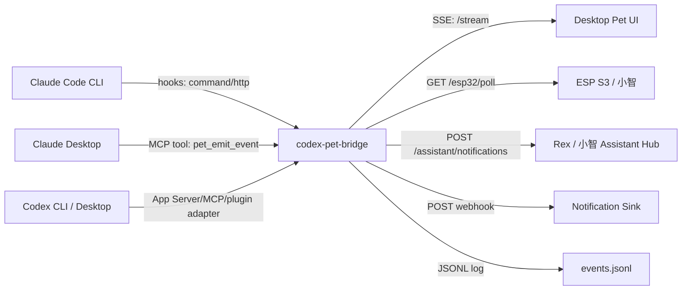

# Codex Pet Bridge

一个本地桥接原型：把 Claude Code、Claude Desktop、Codex CLI/桌面端等工具的状态事件，统一转成桌面宠物、小智/ESP S3 或其它提醒设备可以订阅的事件流和未读通知队列。

核心原则是 **不修改上游应用本体**。Claude 侧走官方 hooks / MCP，Codex 侧未来优先走官方 App Server / MCP / 插件扩展点；桌面宠物只需要接入本地 HTTP/SSE 或 webhook。

## 架构



## 快速运行

```bash
node ./src/bridge-server.js
```

默认监听：

```text
http://127.0.0.1:17366
```

常用端点：

- `POST /events`: 写入事件
- `GET /events`: 查看最近事件
- `GET /state`: 查看最新事件
- `GET /stream`: SSE 事件流，适合桌面宠物实时订阅
- `GET /notifications`: 查看未读通知
- `GET /notifications/next`: 查看下一条未读通知
- `POST /notifications/:id/ack`: 标记一条通知为已读
- `GET /esp32/poll`: 给 ESP S3 / 小智用的紧凑轮询接口
- `GET /health`: 健康检查

## 提醒模型

桥接层区分两类数据：

- `PetEvent`: 所有状态事件，比如 thinking、working、completed、needs-attention。
- `PetNotification`: 需要你介入的阶段性提醒，比如任务完成、等待处理、接近完成、出错。

默认会进入未读通知队列的状态：

```text
needs-attention, completed, near-complete, error
```

可以用环境变量调整：

```bash
PET_NOTIFY_STATUSES=needs-attention,completed,error node ./src/bridge-server.js
```

同一来源、同一会话、同一项目、同一状态和同一消息会做短时间去重，默认 15 秒：

```bash
PET_NOTIFY_THROTTLE_MS=30000 node ./src/bridge-server.js
```

## Claude Code CLI 接入

把 `pet-claude-hook` 作为观察型 hook 加到用户级 `~/.claude/settings.json` 或项目级 `.claude/settings.json`。

示例：

```json
{
  "hooks": {
    "Notification": [
      {
        "matcher": "",
        "hooks": [
          {
            "type": "command",
            "command": "node /ABS/PATH/TO/src/claude-hook.js"
          }
        ]
      }
    ],
    "UserPromptSubmit": [
      {
        "matcher": "",
        "hooks": [
          {
            "type": "command",
            "command": "node /ABS/PATH/TO/src/claude-hook.js"
          }
        ]
      }
    ],
    "Stop": [
      {
        "matcher": "",
        "hooks": [
          {
            "type": "command",
            "command": "node /ABS/PATH/TO/src/claude-hook.js"
          }
        ]
      }
    ]
  }
}
```

推荐先只接 `Notification`、`UserPromptSubmit`、`Stop` 三类事件。它们足够驱动宠物的“思考中 / 需要你 / 已完成”状态，也不会把每次工具调用都刷到 UI 上。

## Claude Desktop / Claude Code MCP 接入

MCP 入口提供一个工具：

- `pet_emit_event`: 主动发送一句状态或气泡文本给宠物

这个工具支持 `status`、`message`、`notify`、`progress`、`workspace`、`sessionId`。如果某个任务接近完成，可以发 `status: "near-complete"`；如果明确需要提醒，即使状态不是默认提醒状态，也可以传 `notify: true`。

Claude Code 可用：

```bash
claude mcp add --transport stdio codex-pet-bridge -- node /ABS/PATH/TO/src/mcp-server.js
```

Claude Desktop 可在 `claude_desktop_config.json` 里加入：

```json
{
  "mcpServers": {
    "codex-pet-bridge": {
      "type": "stdio",
      "command": "node",
      "args": ["/ABS/PATH/TO/src/mcp-server.js"],
      "env": {
        "PET_BRIDGE_URL": "http://127.0.0.1:17366/events"
      }
    }
  }
}
```

## 桌面宠物接入

宠物端最简单的方式是订阅 SSE。普通 `message` 事件会包含所有事件，`notification` 事件只包含需要提醒你的节点：

```js
const stream = new EventSource("http://127.0.0.1:17366/stream");
stream.onmessage = (event) => {
  const petEvent = JSON.parse(event.data);
  renderPetReaction(petEvent.status, petEvent.message);
};
stream.addEventListener("notification", (event) => {
  const notification = JSON.parse(event.data);
  showUnreadBubble(notification.title, notification.message);
});
```

如果宠物已经有 HTTP 接收接口，也可以设置：

```bash
PET_WEBHOOK_URL=http://127.0.0.1:3000/pet/events node ./src/bridge-server.js
```

如果只想把重要提醒推到另一个通知服务：

```bash
PET_NOTIFICATION_WEBHOOK_URL=http://127.0.0.1:3000/notify node ./src/bridge-server.js
```

## ESP S3 / 小智接入

给 ESP S3 推荐先用 HTTP 轮询，稳定、简单，也不依赖长连接：

```http
GET http://127.0.0.1:17366/esp32/poll
```

返回是紧凑 JSON：

```json
{
  "ok": true,
  "unread_count": 1,
  "current_status": "completed",
  "notification": {
    "id": "uuid",
    "source": "claude-code",
    "status": "completed",
    "priority": 1,
    "title": "Task completed",
    "message": "Claude Code task completed",
    "project": "/path/to/project",
    "time": "2026-05-03T12:00:00.000Z"
  }
}
```

设备播报或显示后，可以标记已读：

```http
POST http://127.0.0.1:17366/notifications/<id>/ack
```

如果设备端只能发 GET，也可以在下一次轮询时带上上一条已处理通知：

```http
GET http://127.0.0.1:17366/esp32/poll?ack=<id>
```

后续如果小智那边已经有 MQTT 或 WebSocket 通道，可以只新增一个 sink adapter，把 `PetNotification` 转成对应协议；Claude/Codex 侧不用改。

## Rex / 小智 Assistant Hub 接入

如果 Mac mini 已经运行 Rex / 小智后端，推荐让本 bridge 直接复用它的 `/assistant/notifications`，不要再给小智单独搭一套状态服务：

```bash
XIAOZHI_ASSISTANT_URL=http://192.168.8.109:8003 \
XIAOZHI_SOURCE_PREFIX=mbp \
node ./src/bridge-server.js
```

bridge 会把内部状态映射成当前小智后端的稳定 payload：

```json
{
  "source": "mbp-codex",
  "task": "mbp-codex-active",
  "status": "done",
  "message": "Codex turn ended",
  "priority": "normal",
  "needs_user": true
}
```

映射规则：

- `thinking / working / started / running / progress / near-complete` -> `running`
- `completed / done / success / finished` -> `done + needs_user`
- `needs-attention / waiting-user` -> `waiting_user + needs_user`
- `error / failed / blocked` -> `error + needs_user`
- 通知 ack -> `clear`

当前 Rex 后端会负责最终视觉策略：Codex 蓝紫运行、Claude 橙色运行、完成时绿色快速闪烁并临时拉高亮度，然后自动恢复。bridge 只负责发语义事件，不直接决定屏幕颜色。

为了避免多设备互相覆盖，`source` 和 `task` 必须稳定。推荐：

- MBP Codex: `source=mbp-codex`, `task=mbp-codex-active`
- Mac mini Codex: `source=mini-codex`
- Windows Codex: `source=win-codex`
- MBP Claude Code: `source=mbp-claude`
- Mac mini Claude Code: `source=mini-claude`

如果小智后端未来加鉴权，可以设置：

```bash
XIAOZHI_WEBHOOK_TOKEN="<token>"
```

## 面向未来更新的边界

- 不 patch Codex Desktop、Claude Desktop 或 Claude Code 的安装包。
- 只使用官方扩展点：Claude Code hooks、MCP、本地插件；Codex 侧优先 App Server / MCP / Codex 插件。
- 所有上游事件先规范化成内部 `PetEvent`，UI 不依赖 Claude/Codex 的原始 payload。
- 所有提醒再规范化成内部 `PetNotification`，桌面宠物、ESP S3、手机推送都消费同一种提醒格式。
- hook 失败时退出码仍为 0，不阻塞 Claude Code 的正常工作。
- 桥接层可同时支持 SSE、HTTP polling、webhook、JSONL 日志；未来换宠物 UI 或加入小智设备时不用改 Claude/Codex 配置。

## 更多文档

- [Architecture](./docs/ARCHITECTURE.md)
- [Security](./docs/SECURITY.md)
- [Mac Mini Deployment](./docs/MAC_MINI_DEPLOYMENT.md)
- [References](./docs/REFERENCES.md)

## 验证

```bash
node ./test/smoke.js
```

如果你的机器有 `npm`，也可以使用 `npm run start` 和 `npm run smoke`。

## 参考

- OpenAI: Codex Desktop App 和 Codex harness 共享 App Server / JSON-RPC 方向。
- Claude Code 官方文档: hooks 支持 command/http/MCP tool，hook 输入包含 `session_id`、`cwd`、`hook_event_name` 等字段。
- Claude Code 官方文档: MCP 支持 `claude mcp add`、`claude mcp add-json`，也可从 Claude Desktop 导入 MCP 配置。
