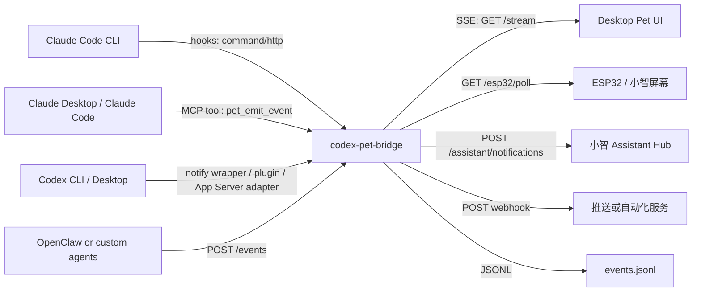

<div align="center">

# Codex Pet Bridge

**面向 Codex、Claude Code、桌面宠物和小智设备的本地状态桥。**

一个小小的本地中枢，让每个 Agent 的状态都能被看见。

[English](README.md) · 中文

[](LICENSE)
[](https://nodejs.org/)
[](#项目状态)
[](#安全模型)

</div>

---

## 它解决什么问题

长时间运行的 Coding Agent 真正需要的是“在正确的时刻提醒你回来”。Codex、Claude Code、Claude Desktop、OpenClaw 和各种自动化任务可能分散在 MacBook Pro、Mac mini、Windows 或其它机器上，但它们的状态通常只留在各自窗口里。

这会带来三个实际问题：

1. **注意力被切碎**：一个 Codex 任务在跑，另一个 Claude Code 任务等你批准，但房间里没有一个统一提示。
2. **脆弱集成容易坏**：直接 patch App、抓 UI 或依赖内部实现，遇到上游更新就会失效。
3. **物理提示需要稳定协议**：桌面宠物、ESP32 屏幕或小智机器人不应该理解每个上游工具的原始 payload。

Codex Pet Bridge 就是这个缺失的本地通知层。

## 它能做什么

- 把上游 Agent 事件统一成稳定的 `PetEvent`。
- 为需要你介入的事件生成未读 `PetNotification` 队列。
- 通过 SSE 把实时状态推给桌面宠物 UI。
- 给 ESP32 / 小智类设备提供紧凑轮询接口。
- 把语义化任务状态转发到 Mac mini 上的小智 Assistant Hub。
- 写入 JSONL 日志用于排查，但默认不存原始 prompt。
- 本地优先：默认只监听 localhost；如果暴露到局域网，要求 token。

## 架构



项目原则是不 patch Codex Desktop、Claude Desktop、Claude Code 或小智固件。所有上游事件都通过公开 hook、MCP、webhook、plugin 或轮询 adapter 进入，再被规范化为同一种内部事件。

小智接入属于社区 / 家庭实验室集成，不代表小智官方产品或官方背书。

## 快速开始

```bash
git clone https://github.com/vcxzvfe/codex-pet-bridge.git
cd codex-pet-bridge
npm run start
```

默认地址：

```text
http://127.0.0.1:17366
```

发送测试事件：

```bash
curl -sS http://127.0.0.1:17366/events \
  -H 'content-type: application/json' \
  -d '{
    "source": "codex",
    "task": "demo-runtime",
    "status": "running",
    "message": "Codex is working on the demo"
  }'
```

## API

| Endpoint | 用途 |
| --- | --- |
| `POST /events` | 写入一个规范化或半原始上游事件。 |
| `GET /events` | 查看最近事件。 |
| `GET /state` | 查看最新事件和未读数量。 |
| `GET /stream` | 通过 SSE 订阅实时事件。 |
| `GET /notifications` | 查看未读通知。 |
| `GET /notifications/next` | 查看下一条未读通知。 |
| `POST /notifications/:id/ack` | 标记单条通知已读。 |
| `POST /notifications/ack-all` | 标记全部通知已读。 |
| `GET /esp32/poll` | 给 ESP32 / 小智设备用的紧凑轮询接口。 |
| `GET /health` | 健康检查。 |

## 事件模型

`PetEvent` 是完整实时状态流，适合动画、诊断、日志和下游 adapter。

```json
{
  "source": "codex",
  "task": "mbp-codex-runtime",
  "status": "running",
  "message": "MBP Codex task is running",
  "workspace": "/path/to/project",
  "sessionId": "optional-upstream-session"
}
```

`PetNotification` 是“需要人介入”的未读队列。默认进入通知队列的状态是：

```text
needs-attention, completed, near-complete, error
```

可以通过环境变量调整：

```bash
PET_NOTIFY_STATUSES=needs-attention,completed,error npm run start
```

同一来源、任务、会话、工作区、状态和消息会短时间去重，默认 15 秒：

```bash
PET_NOTIFY_THROTTLE_MS=30000 npm run start
```

## 边界

这个 bridge 故意保持窄职责：

- 不渲染桌面宠物 UI。
- 不直接决定小智屏幕颜色、亮度或夜间策略。
- 不 patch 上游 App bundle。
- 默认不保存完整原始上游 payload。

这些职责分别属于下游 UI、小智后端、官方扩展点或具体 adapter。

## Claude Code CLI 接入

把 `pet-claude-hook` 作为观察型 hook 加到用户级 `~/.claude/settings.json` 或项目级 `.claude/settings.json`。

```json
{
  "hooks": {
    "Notification": [
      {
        "matcher": "",
        "hooks": [
          {
            "type": "command",
            "command": "node /ABS/PATH/TO/src/claude-hook.js"
          }
        ]
      }
    ],
    "UserPromptSubmit": [
      {
        "matcher": "",
        "hooks": [
          {
            "type": "command",
            "command": "node /ABS/PATH/TO/src/claude-hook.js"
          }
        ]
      }
    ],
    "Stop": [
      {
        "matcher": "",
        "hooks": [
          {
            "type": "command",
            "command": "node /ABS/PATH/TO/src/claude-hook.js"
          }
        ]
      }
    ]
  }
}
```

建议先只接 `Notification`、`UserPromptSubmit`、`Stop`。它们足够表达“思考中 / 等你处理 / 已完成”，又不会把每一次工具调用都刷到屏幕上。

hook 失败时会返回退出码 `0`，不会阻塞 Claude Code 本身。

## Claude Desktop / MCP

stdio MCP server 提供一个工具：

- `pet_emit_event`：主动发送一句状态气泡或通知事件。

Claude Code：

```bash
claude mcp add --transport stdio codex-pet-bridge -- node /ABS/PATH/TO/src/mcp-server.js
```

Claude Desktop：

```json
{
  "mcpServers": {
    "codex-pet-bridge": {
      "type": "stdio",
      "command": "node",
      "args": ["/ABS/PATH/TO/src/mcp-server.js"],
      "env": {
        "PET_BRIDGE_URL": "http://127.0.0.1:17366/events"
      }
    }
  }
}
```

## Codex 接入

Codex 侧保持轻量、本地、可替换。当前可行路径：

- 用 Codex notify wrapper 在 turn 结束时 `POST /events`。
- 用轻量 activity bridge 判断“运行中”状态。
- 等公开扩展点稳定后，再接 Codex plugin 或 App Server adapter。

运行中事件示例：

```bash
curl -sS http://127.0.0.1:17366/events \
  -H 'content-type: application/json' \
  -d '{
    "source": "codex",
    "task": "mbp-codex-runtime",
    "status": "running",
    "message": "Codex is working"
  }'
```

完成事件示例：

```bash
curl -sS http://127.0.0.1:17366/events \
  -H 'content-type: application/json' \
  -d '{
    "source": "codex",
    "task": "mbp-codex-runtime",
    "status": "completed",
    "message": "Codex task completed",
    "notify": true
  }'
```

## 桌面宠物接入

订阅 SSE：

```js
const stream = new EventSource("http://127.0.0.1:17366/stream");

stream.onmessage = (event) => {
  const petEvent = JSON.parse(event.data);
  renderPetReaction(petEvent.status, petEvent.message);
};

stream.addEventListener("notification", (event) => {
  const notification = JSON.parse(event.data);
  showUnreadBubble(notification.title, notification.message);
});
```

如果桌面宠物已经有 HTTP 接收接口：

```bash
PET_WEBHOOK_URL=http://127.0.0.1:3000/pet/events npm run start
```

如果只想推送重要提醒：

```bash
PET_NOTIFICATION_WEBHOOK_URL=http://127.0.0.1:3000/notify npm run start
```

## 小智 Assistant Hub

如果 Mac mini 已经运行小智 Assistant Hub，推荐让 bridge 直接复用它的 `/assistant/notifications`，不要再给设备单独搭一套状态服务。

```bash
XIAOZHI_ASSISTANT_URL=http://192.168.8.109:8003 \
XIAOZHI_SOURCE_PREFIX=mbp \
npm run start
```

bridge 会发送：

```text
POST <XIAOZHI_ASSISTANT_URL>/assistant/notifications
```

payload 形态：

```json
{
  "source": "mbp-codex",
  "task": "mbp-codex-runtime",
  "status": "running",
  "message": "MBP Codex task is running",
  "priority": "normal",
  "needs_user": false
}
```

状态映射：

| Bridge 状态 | 小智状态 |
| --- | --- |
| `thinking`, `working`, `started`, `running`, `progress`, `near-complete` | `running` |
| `completed`, `done`, `success`, `finished` | `done` |
| `needs-attention`, `waiting-user` | `waiting_user` |
| `error`, `failed`, `blocked` | `error` |
| `idle`, `clear`, `ack`, `dismissed` | `clear` |

小智后端负责最终屏幕策略。当前家中部署中：有任务运行时即使处于夜间也会亮屏；Codex 是蓝紫色，Claude Code 是橙色，OpenClaw 是青绿色；任务完成时短暂高亮绿色闪烁，随后回到日间 / 夜间屏幕日程。

推荐 source 命名：

| 机器 / 工具 | Source |
| --- | --- |
| MacBook Pro Codex | `mbp-codex` |
| Mac mini Codex | `mini-codex` |
| Windows Codex | `win-codex` |
| MacBook Pro Claude Code | `mbp-claude` |
| Mac mini Claude Code | `mini-claude` |
| OpenClaw | `openclaw` |

## ESP32 / 小智轮询

给简单固件或原型屏幕使用 HTTP polling：

```http
GET http://127.0.0.1:17366/esp32/poll
```

返回：

```json
{
  "ok": true,
  "unread_count": 1,
  "current_status": "completed",
  "notification": {
    "id": "uuid",
    "source": "claude-code",
    "task": "project-name",
    "status": "completed",
    "priority": 1,
    "title": "Task completed",
    "message": "Claude Code task completed",
    "project": "/path/to/project",
    "time": "2026-05-03T12:00:00.000Z"
  }
}
```

展示或播报后标记已读：

```http
POST http://127.0.0.1:17366/notifications/<id>/ack
```

如果设备只能发 GET：

```http
GET http://127.0.0.1:17366/esp32/poll?ack=<id>
```

## 安全模型

这个项目面向可信本机和家庭局域网，不应该直接暴露到公网。

- 默认监听 `127.0.0.1`。
- 非 loopback 监听时，如果没有 `PET_BRIDGE_TOKEN` 会拒绝启动。
- 支持 `Authorization: Bearer <token>`、`x-pet-bridge-token` 或 `?token=...`。
- 默认不存原始上游 payload。
- 如果启用 `PET_BRIDGE_STORE_RAW=1`，会对常见 secret 字段做脱敏。
- hook 是观察型；bridge 掉线不会影响上游工具继续运行。

推荐多设备部署方式是 Mac mini 常驻运行 bridge，笔记本通过 SSH tunnel 发事件。详见 [Mac Mini Deployment](docs/MAC_MINI_DEPLOYMENT.md)。

## 项目状态

> Alpha。已经适合本地实验，但 API 细节仍可能调整。

当前代码库已验证：

- HTTP 事件写入
- SSE 实时流
- 未读通知队列和 ack
- Claude Code command hook
- MCP stdio tool
- ESP32 轮询接口
- 小智 Assistant Hub sink
- localhost 优先的安全保护

仍属实验或依赖具体部署：

- 官方 Codex plugin / App Server adapter
- 更丰富的桌面宠物 UI 示例
- 加密持久化通知存储
- LaunchAgent / 安装包
- 多设备身份命名策略

## 兼容性

| 集成 | 当前预期 |
| --- | --- |
| Node.js | 20 或更高 |
| Claude Code | command hooks 和 stdio MCP |
| Claude Desktop | stdio MCP 配置 |
| Codex | notify wrapper、本地进程桥，或未来 plugin / App Server adapter |
| 小智 | 兼容 `/assistant/notifications` 的 Assistant Hub |
| ESP32 | HTTP 轮询 `/esp32/poll` |

## 文档

- [Architecture](docs/ARCHITECTURE.md)
- [Security](docs/SECURITY.md)
- [Mac Mini Deployment](docs/MAC_MINI_DEPLOYMENT.md)
- [References](docs/REFERENCES.md)

## 验证

```bash
npm run smoke
```

或：

```bash
node ./test/smoke.js
```

## 贡献

欢迎 issue 和 PR。适合贡献的方向包括：新 adapter、桌面宠物 UI 示例、文档修正、真实多机环境测试覆盖。

请保持集成层足够薄：使用官方 hooks、MCP、plugin、本地 HTTP 或 polling API；不要 patch 上游 App bundle。

## License

[MIT](LICENSE) © 2026 Zifan and Codex Pet Bridge contributors.
