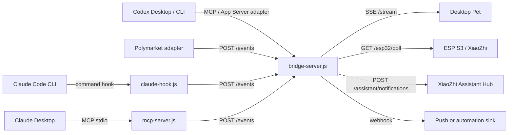

# Architecture

Codex Pet Bridge is a local notification hub for coding agents and small ambient devices.

The bridge deliberately avoids patching Codex Desktop, Claude Desktop, Claude Code, or device firmware. Every upstream integration should enter through a stable public extension point, then be normalized into one internal event shape.

## Components



## Data Model

`PetEvent` is the full state feed. It is useful for live UI animation, logs, and diagnostics.

`PetNotification` is the intervention queue. It is intentionally smaller and more stable so it can be consumed by the desktop pet, ESP S3, future push notification sinks, or another project.

Default notification statuses:

- `needs-attention`
- `completed`
- `near-complete`
- `error`

## Integration Policy

Adapters should stay thin:

- Read upstream events from a public hook, MCP tool, webhook, or polling API.
- Normalize to `PetEvent`.
- Let `bridge-server.js` decide whether to enqueue a `PetNotification`.
- Avoid storing upstream secrets or full prompts unless explicitly enabled.

This keeps future upstream updates local to one adapter instead of touching the notification devices.

## XiaoZhi Sink

When `XIAOZHI_ASSISTANT_URL` is set, the bridge forwards normalized semantic events to the Mac mini assistant hub:

```text
POST <XIAOZHI_ASSISTANT_URL>/assistant/notifications
```

This sink deliberately reuses the assistant hub's existing `source/task/status/message/priority/needs_user` contract. The bridge does not choose screen colors or brightness directly. The XiaoZhi backend owns visual policy, including Codex blue-purple running state, Claude orange running state, and green completion flashes.

Status mapping:

- active states become `running`
- completed states become `done` with `needs_user=true`
- attention states become `waiting_user` with `needs_user=true`
- failures become `error` with `needs_user=true`
- notification ack becomes `clear`

Use stable `source + task` values so the assistant hub can maintain one active/pending state per real task.
