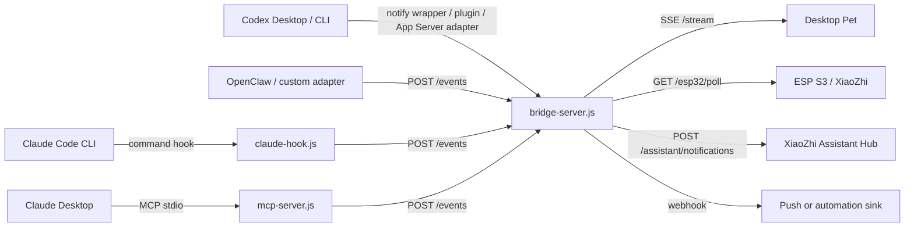

# Architecture

Codex Pet Bridge is a local-first status hub for coding agents, desktop pets, and small ambient devices such as XiaoZhi.

The bridge deliberately avoids patching Codex Desktop, Claude Desktop, Claude Code, or device firmware. Every upstream integration should enter through a stable public extension point, then be normalized into one internal event shape.

## Components


```mermaid
flowchart LR
  ClaudeCode["Claude Code CLI"] -->|"command hook"| Hook["claude-hook.js"]
  ClaudeDesktop["Claude Desktop"] -->|"MCP stdio"| MCP["mcp-server.js"]
  Codex["Codex Desktop / CLI"] -->|"notify wrapper / plugin / App Server adapter"| Bridge["bridge-server.js"]
  Custom["OpenClaw / custom adapter"] -->|"POST /events"| Bridge
  Hook -->|"POST /events"| Bridge
  MCP -->|"POST /events"| Bridge
  Bridge -->|"SSE /stream"| Pet["Desktop Pet"]
  Bridge -->|"GET /esp32/poll"| ESP["ESP S3 / XiaoZhi"]
  Bridge -->|"POST /assistant/notifications"| XiaoZhi["XiaoZhi Assistant Hub"]
  Bridge -->|"webhook"| Push["Push or automation sink"]
```

## Data Model

`PetEvent` is the full state feed. It is useful for live UI animation, logs, and diagnostics.

`PetNotification` is the intervention queue. It is intentionally smaller and more stable so it can be consumed by the desktop pet, ESP S3, future push notification sinks, or another project.

Default notification statuses:

- `needs-attention`
- `completed`
- `near-complete`
- `error`

## Integration Policy

Adapters should stay thin:

- Read upstream events from a public hook, MCP tool, webhook, or polling API.
- Normalize to `PetEvent`.
- Let `bridge-server.js` decide whether to enqueue a `PetNotification`.
- Avoid storing upstream secrets or full prompts unless explicitly enabled.

This keeps future upstream updates local to one adapter instead of touching the notification devices.

## Activity Detection

`pet-agent-sync` answers one question per agent: is a turn open right now? Both
answers used to be inferred from side effects, and both were wrong in the same
direction, reporting "running" forever.

**Codex.** A rollout is active when its newest turn boundary is a start
(`task_started`, `user_message`) rather than an end (`task_complete`,
`turn_complete`, `turn_aborted`, `error`, `shutdown_complete`). Inspecting only the
last record does not work: Codex appends `token_count`, sub-agent activity, and
inter-agent metadata *after* the completion record, and the desktop app keeps one
rollout open for hours, so the final line is almost never `task_complete`. The tail
window is 512KB because a single reasoning payload can be tens of kilobytes; a turn
whose start has scrolled out reads as closed, which is the safe way to be wrong.

**Claude Code.** Taken from the hooks, not from `ps`. `UserPromptSubmit` and `Stop`
bracket a turn exactly, and `claude-hook.js` records that boundary to
`PET_CLAUDE_TURN_STATE`. Process CPU cannot answer this: `%cpu` is a decaying
average, so a process that was busy a minute ago still reports over 1%, and a turn
is mostly network wait regardless. `SessionEnd` and a max-age guard close turns that
end without `Stop`.

**One owner per task id.** Two daemons publishing the same task with different
heuristics will flap: one sends `running` while the other sends `done`, and `done`
carries needs-user, which is the brightest state a screen has. `pet-agent-sync` owns
both channels; nothing else should publish those task ids.

## Quiet Gate

The gate lives in `notify-client.js`, so every producer inherits it, and suppressed
events are dropped rather than queued. See the README for configuration. Two design
notes worth keeping:

- Failure inside the night envelope resolves to *quiet*. A monitoring system that
  wakes someone when it loses its data source gets switched off.
- Optional Home Assistant integration is read-only: the gate queries `/api/states`
  and never calls a service.

## XiaoZhi Sink

When `XIAOZHI_ASSISTANT_URL` is set, the bridge forwards normalized semantic events to the Mac mini assistant hub:

```text
POST <XIAOZHI_ASSISTANT_URL>/assistant/notifications
```

This sink deliberately reuses the assistant hub's existing `source/task/status/message/priority/needs_user` contract. The bridge does not choose screen colors or brightness directly. The XiaoZhi backend owns visual policy, including Codex blue-purple running state, Claude orange running state, OpenClaw teal-green running state, green completion flashes, and day/night screen brightness.

Status mapping:

- active states become `running`
- completed states become `done`
- attention states become `waiting_user` with `needs_user=true`
- failures become `error` with `needs_user=true`
- notification ack becomes `clear`

Use stable `source + task` values so the assistant hub can maintain one active or completed state per real task. Example source labels are `laptop-codex`, `hub-codex`, `win-codex`, `laptop-claude`, `hub-claude`, and `openclaw`.

In a typical XiaoZhi backend policy, active tasks override night screen-off mode. When all tasks complete, the backend returns to idle; during scheduled night hours idle means brightness `0`.
